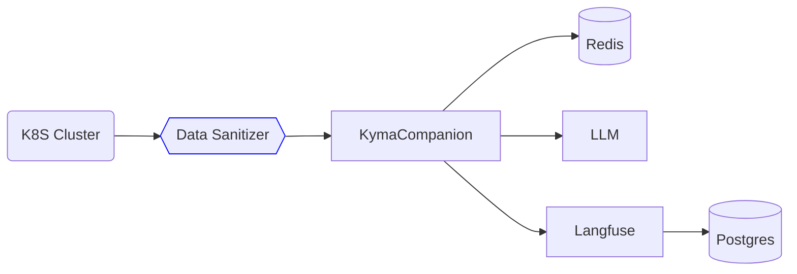

# Data Sanitization

This document describes the data sanitization process for the Kyma Companion.

## Resources with Sensitive Data

- Secrets - skip data part of the secret!
- Workloads (Deployment, Pod, StatefulSet, DaemonSet, etc.) - may contain sensitive data in the spec
- ConfigMaps - may contain some information, that may be sensitive
- Custom Resources - may contain sensitive data
- and others.

## Implementation

The Data Sanitizer service provides a centralized way to remove sensitive information from Kubernetes resources before they are processed by LLMs, stored in Langfuse, or saved to checkpoints.



The sanitization is implemented in `data_sanitizer.py` and follows these principles:
- Non-destructive: Original data is not modified
- Recursive: Handles nested structures
- Configurable: Sensitive field patterns can be extended
- Kubernetes-aware: Special handling for k8s resource types

## Configuration
The resources, field names and patterns can be configured in the `sanitization_config` section of the `config.json` file. If not set these values are used by default by the sanitizer:
```json
{
    ...
    "sanitization_config": {
        "resources_to_sanitize": [
                "Deployment",
                "DeploymentList",
                "Pod",
                "PodList",
                "StatefulSet",
                "StatefulSetList",
                "DaemonSet",
                "DaemonSetList",
                "Job",
                "JobList",
                "CronJob",
                "CronJobList"
        ],
        "sensitive_field_names": [
                "password",
                "secret",
                "token",
                "key",
                "cert",
                "credential",
                "private",
                "auth",
                "username",
                "user_name",
                "firstname",
                "first_name",
                "lastname",
                "last_name"
        ],
        "sensitive_env_vars": [
                "TOKEN",
                "SECRET",
                "PASSWORD",
                "PASS",
                "KEY",
                "CERT",
                "PRIVATE",
                "CREDENTIAL",
                "AUTH",
                "USERNAME",
                "USER_NAME"
        ],
        "sensitive_field_to_exclude": [
            "secretName",
            "authorizers"
        ]
    },
    ...
}
```
**NOTE**: The `sensitive_field_to_exclude` is used to exclude fields from the sanitization process. If excluded, these fields are not redacted altough they are configured in the `sensitive_field_names`.

## Further Work

Check the production clusters for resources with sensitive data and add them to the list of resources with sensitive data.
